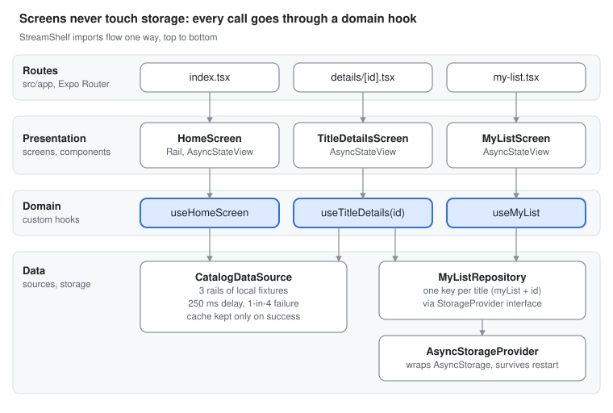

# StreamShelf

A CTV-style streaming catalog built with React Native, Expo and `react-native-tvos`. It runs on Android TV, phones and the web, and can be driven with a TV remote (D-pad) or the keyboard.

It started as a timeboxed (4–6 hour) take-home assessment: a home screen with content rails, a detail screen, and a persisted My List. After submitting, I extended it with shared My List state, a video player that resumes where you left off, and a polish pass on tests and error handling.

## Features

- **Home:** three horizontal rails of titles. The first poster takes remote focus when the screen loads.
- **Title details:** artwork, description and date, plus Add to / Remove from My List. Selecting the poster plays the video.
- **My List:** saved titles survive an app restart. Each one is focusable and opens its details.
- **Video player:** plays with `expo-video`, saves your position every few seconds, resumes where you stopped, and offers one retry if playback fails.
- **Async states:** every screen shows the same loading, empty and error states, with a Try again button that takes remote focus.

## Architecture

Unidirectional data flow, separated into layers:

- **Routes** (`src/app`): Expo Router files. They read route parameters and render a screen, nothing else.
- **Presentation** (`src/presentation`): screens and reusable components. They only talk to the domain layer.
- **Domain** (`src/domain`): custom hooks and the My List context, which hold the logic and state.
- **Data** (`src/data`): where data comes from. Data sources and repositories sit behind interfaces (`DataSource`, `StorageProvider`).

Imports only flow downward, so presentation never touches the data layer directly. That keeps screens simple, lets the hooks be tested without UI, and means a storage or API change happens in one place.

Given the original timebox and the small number of screens, there's no tab bar: a button on the home screen opens My List. In production, My List would live in a tab or side navigation designed for the remote.

## Focus and TV input

Focus uses plain `Pressable`s with `focusable`, `onFocus` and `onBlur`, so the same code works with a TV remote and with Tab on the web, and is harmless on phones. `FocusablePoster` keeps its focus state inside itself, so moving the D-pad re-renders only the poster losing focus and the one gaining it, not the whole rail.

Initial focus (first poster on Home, the poster on Details, Try again on errors) uses `hasTVPreferredFocus`. It still works in this version, but it's deprecated upstream; see What I'd do next.

## My List (shared state)

`MyListProvider` wraps the navigation stack, so Home, Details and My List all read the same list through the `useMyList()` hook. Adding or removing a title updates every screen immediately, with no reloading, and the hook throws a clear error if it's used outside the provider.

- Updates are **optimistic**: the screen changes first, then the change is written to storage.
- The **Empty** state is derived from the list instead of stored separately, so the two can never disagree.
- `MyListRepository` stores one AsyncStorage key per title, so each add or remove is a single write.

## Video player

`useVideoProgress` wraps `expo-video`'s player:

- On open, it reads the saved position from `WatchProgressRepository` and seeks there once the video is ready.
- While playing, it saves the position at most every 3 seconds, and clears it within 5 seconds of the end so finished videos start over.
- If playback fails, it offers one retry. If the retry isn't ready within 5 seconds, it shows the error state.

`WatchProgressRepository` goes through the same `StorageProvider` interface as My List.

## AsyncStateView

`AsyncStateView` renders the states every async screen goes through: loading, loaded, empty and error. Centralizing them means every screen behaves the same way, and one set of tests covers them all. Screens can override the default loading, empty or error UI, and pass `onRetry` to show a Try again button.

## Storage

`AsyncStorageProvider` implements the `StorageProvider` interface and is the only file that knows about AsyncStorage. Repositories take a `StorageProvider` in their constructor (defaulting to AsyncStorage), so the storage library can change in one place and tests can inject an in-memory fake.

## Data source

`CatalogDataSource` simulates a network call: a 250 ms delay with `setTimeout`, and a 1-in-4 chance of failure (a random number from 1 to 4; a 4 rejects the promise). That exercises every loading and error state. The catalog is cached for the session, but only on success, so a failed load can be retried. In production the cache would be much shorter-lived, if used at all.

The fixtures use sized placeholder images from Picsum and a public sample video, so they load reliably on TV hardware without hotlinking anyone's artwork.

If the goal had been to show full-stack work, I'd have made this a REST API instead, potentially with Docker Compose, Postgres and a Node.js API with a shared model contract. That's a direction I'd enjoy, but it was beside the point of a CTV and React Native exercise.

## Getting started

These instructions use npm and npx; substitute your package manager if you use another.

1. Install dependencies: `npm install`
2. Start the Expo server: `npx expo start`

**Android TV emulator:** set `EXPO_TV=1` (on Windows, `set EXPO_TV=1`), run a prebuild with `npx expo prebuild --clean`, then `npx expo run:android` with an Android TV emulator running.

## Testing

Run `npm test` from the project root.

- `AsyncStateView`: each state, and that Try again calls `onRetry`.
- `useTitleDetails`: adding to My List updates the shared list, and reload recovers from a failed load.
- `MyListProvider`: add and remove keep the list and its Empty state in sync, storage errors show the Error state, and using the hook outside the provider fails clearly.
- `CatalogDataSource`: the simulated failure and the cache, using fake timers and a mocked random number, so the tests never depend on chance.
- `WatchProgressRepository`: save, read, remove and ordering, using an in-memory `StorageProvider` injected through the constructor.

## Where AI is leveraged in this project

For the original submission, I intentionally limited how much I leaned on AI, since the goal was to show what I can do, the patterns I rely on, and my code style. Where I did use it:

- **Sanity-checking my own architecture decisions.** I initially planned three phases, the first being Docker Compose, a Node.js server with Prisma-modeled REST APIs, and Postgres. I asked AI for its honest opinion, and it confirmed what I already suspected: a full backend wasn't the focus of this take-home.
- **Talking through architecture abstractly, without generating code.** I described the architecture I had in mind (unidirectional data flow, layers separated by responsibility, reusable components) and asked it to stay abstract rather than write code.
- **Cleaning up this README.** I used AI to help with formatting and wording.
- **Quick syntax and documentation lookups**, such as naming conventions.
- **A final pass against the requirements.** I gave Claude the requirements, my commit log and the project, and asked it to catch gotchas and confirm the requirements were met. It found about half a dozen minor issues, which I fixed in my last commits on 9/21/2026.

After submitting, I built the My List context and the video player myself, then used Claude for a review and polish pass from a to-do list we worked out together: fixing the bugs it found, moving `WatchProgressRepository` behind `StorageProvider`, extracting `FocusablePoster`, adding Retry, clearing the lint errors and expanding the tests. I reviewed the changes and verified them with `tsc`, lint, the unit tests and the Android TV emulator.

## What I'd do next

- **Replace `hasTVPreferredFocus`**, which is deprecated upstream, with a ref and `focus()`, and use `TVFocusGuideView` (with `autoFocus`) so each rail remembers its last focused poster.
- **A single async state** (`useAsync` with a discriminated-union reducer), so "loaded" always carries its data and screens don't need `?.`.
- **A `renderLoaded(data)` render prop** on `AsyncStateView`, so the loaded UI is only built when it's shown.
- **Virtualize the home screen** with a vertical `FlatList` of rails, and switch posters to `expo-image` (already installed) for disk caching and downsampling.
- **Order My List** by an `addedAt` timestamp, and use a delimiter in the storage key prefix.
- **An inline message instead of the full-screen error** when an add or remove fails, with a rollback of the optimistic update.
- **More device testing.** I tested on the web, a physical Android phone and the Android TV emulator, but not on tvOS or real TV hardware.
- **UI polish:** shared colors and typography (a small design system), larger type and focus states for 10-foot viewing, and separate phone and TV layouts where they help.
